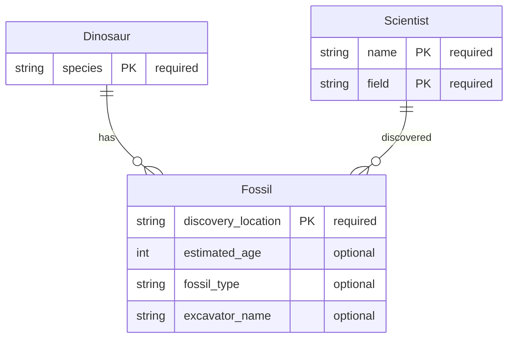

# TRex Software Factory

The ERD below is the **single source of truth** for all Kinds in this project. The software factory reads this ERD as Desired State, scans the codebase as Actual State, and reconciles the difference by generating, updating, or removing Kinds across all generators.

---

## Entity Relationship Diagram (Desired State)



### ERD Syntax Reference

Each entity block maps to a Kind. The factory parses entities and relationships to drive all generators.

**Entity definition:**

```
KindName {
    <type> <field_name> [PK|FK|UK] ["required"|"optional"]
}
```

| Element | Meaning | Maps to |
| --- | --- | --- |
| `KindName` | PascalCase Kind name | `--kind KindName` |
| `<type>` | Field type | `string`, `int`, `int64`, `bool`, `float`, `time` |
| `<field_name>` | snake_case field name | Generator converts to PascalCase/camelCase automatically |
| `PK` | Primary key marker | Used for documentation only (`id` is always the real PK via `api.Meta`) |
| `FK` | Foreign key marker | Generates `<parent>_id` field, GORM tag, migration constraint, nested routes |
| `UK` | Unique key marker | Generates unique index in migration |
| `"required"` | Non-nullable | Go base type (`string`), in OpenAPI `required` array |
| `"optional"` | Nullable (default) | Go pointer type (`*string`), omitempty in JSON |

**Relationship lines:**

```
ParentKind ||--o{ ChildKind : "label"     %% one-to-many
KindA ||--|| KindB : "label"              %% one-to-one
KindA }o--o{ KindB : "label"              %% many-to-many (join table)
```

| Notation | Cardinality | Generator effect |
| --- | --- | --- |
| `\|\|--o{` | One parent, many children | Adds `parent_id` FK to child, `FindByParentID()` DAO method, nested routes |
| `\|\|--\|\|` | One-to-one | Adds `parent_id` FK with unique constraint, nested get endpoint |
| `}o--o{` | Many-to-many | Generates join table migration, association CRUD endpoints |

### Supported Field Types

| ERD Type | Go Type | Go Pointer | DB Type | OpenAPI Type | Proto Type |
| --- | --- | --- | --- | --- | --- |
| `string` | `string` | `*string` | `text` | `string` | `string` |
| `int` | `int` | `*int` | `integer` | `integer (int32)` | `int32` |
| `int64` | `int64` | `*int64` | `bigint` | `integer (int64)` | `int64` |
| `bool` | `bool` | `*bool` | `boolean` | `boolean` | `bool` |
| `float` | `float64` | `*float64` | `double precision` | `number (double)` | `double` |
| `time` | `time.Time` | `*time.Time` | `timestamp` | `string (date-time)` | `Timestamp` |

### Implicit Fields (from api.Meta / db.Model)

Every Kind automatically receives these fields. **Do not include them in the ERD:**

| Field | Type | Source |
| --- | --- | --- |
| `id` | `string` | `api.Meta` (auto-generated KSUID) |
| `created_at` | `time.Time` | `api.Meta` (GORM auto-set) |
| `updated_at` | `time.Time` | `api.Meta` (GORM auto-set) |
| `deleted_at` | `gorm.DeletedAt` | `api.Meta` (soft delete) |

---

## Software Factory Reconciliation Loop

The factory operates as a Kubernetes-style reconciler: it compares Desired State (this ERD) against Actual State (the codebase) and takes action to converge.

```
┌─────────────────────────────────────────────────────────────┐
│                    SOFTWARE FACTORY                          │
│                                                             │
│  ┌──────────┐     ┌──────────┐     ┌───────────────────┐   │
│  │  OBSERVE  │────▶│  DIFF    │────▶│  ACT              │   │
│  │           │     │          │     │                   │   │
│  │ Parse ERD │     │ Compare  │     │ Generate / Delete │   │
│  │ Scan Code │     │ Kinds    │     │ Build / Test      │   │
│  └──────────┘     └──────────┘     │ PR / Review       │   │
│                                     │ Deploy / E2E      │   │
│                                     └───────────────────┘   │
│                                               │             │
│                                               ▼             │
│                                     ┌───────────────────┐   │
│                                     │  VERIFY           │   │
│                                     │                   │   │
│                                     │ Re-scan codebase  │   │
│                                     │ Confirm converged │   │
│                                     └───────────────────┘   │
└─────────────────────────────────────────────────────────────┘
```

### Phase 1: OBSERVE

| Step | Action | Output |
| --- | --- | --- |
| 1a | Parse ERD from this file | Set of desired Kinds with fields, types, nullability, relationships |
| 1b | Scan `plugins/*/` directories | Set of actual Kinds currently in the codebase |
| 1c | Scan `openapi/openapi.*.yaml` | Set of actual OpenAPI sub-specs |
| 1d | Scan `proto/rh_trex/v1/*.proto` | Set of actual proto definitions |

### Phase 2: DIFF

| Condition | Classification |
| --- | --- |
| Kind in ERD, not in codebase | **CREATE** — new Kind needed |
| Kind in codebase, not in ERD | **DELETE** — Kind should be removed |
| Kind in both, fields differ | **UPDATE** — migration + model changes needed |
| Relationship in ERD, not in code | **ADD RELATION** — FK, nested routes, join tables needed |
| Relationship in code, not in ERD | **REMOVE RELATION** — FK cleanup needed |

### Phase 3: ACT

For each diff item, the factory executes a pipeline:

#### 3a. Generate (Agent: TRex)

| Action | Generator | Command |
| --- | --- | --- |
| New Kind | Entity Generator | `go run ./scripts/generator.go --kind <Kind> --fields "<fields>"` |
| SDK regen | SDK Generator | `make generate-sdk` |
| CLI regen | CLI Generator | `make generate-cli` |
| Console regen | Console Plugin Generator | `make generate-console-plugin` |
| Proto regen | Protobuf | `make proto` |
| OpenAPI regen | OpenAPI | `make generate` |

#### 3b. Build & Test (Agent: TRex)

| Step | Command | Pass criteria |
| --- | --- | --- |
| Compile | `make binary` | Exit 0 |
| Lint | `make lint` | Exit 0 |
| Verify | `make verify` | Exit 0 |
| Unit tests | `make test` | All pass |
| DB setup | `make db/teardown && make db/setup` | Container running |
| Migrate | `./trex migrate` | Exit 0 |
| Integration tests | `make test-integration` | All pass |

#### 3c. Pull Request (Agent: TRex -> Reviewer)

| Step | Action |
| --- | --- |
| Branch | Create `factory/<kind>-<timestamp>` branch |
| Commit | Commit all generated + modified files |
| PR | Open PR with diff summary, test results, ERD excerpt |
| Review | Reviewer agent validates against TRex review standards |
| Merge | Auto-merge on approval if all checks green |

#### 3d. Deploy & E2E (Agent: Cluster)

| Step | Action |
| --- | --- |
| Build image | `make image` |
| Push | `make push` |
| Deploy | `make deploy` (or ROSA cluster redeploy) |
| E2E | Exercise all CRUD endpoints for new Kind via curl/SDK |
| Verify | Confirm HTTP 200/201/204 for all operations |

### Phase 4: VERIFY

Re-run Phase 1 (OBSERVE) to confirm Desired State == Actual State. If drift remains, loop back to Phase 2.

---

## Factory Agent Responsibilities

| Agent | Role in Factory |
| --- | --- |
| **TRex** | ERD parser, code generator, build/test executor, PR creator |
| **Reviewer** | Code review against TRex standards, approve/reject PRs |
| **SDK** | Validate SDK regen, run SDK tests |
| **CLI** | Validate CLI regen, run CLI tests |
| **Cluster** | Deploy to ROSA, run E2E tests |
| **FE** | Validate Console Plugin regen, build frontend |
| **Overlord** | Orchestrate pipeline, resolve blockers, sequence agents |

---

## ERD-to-Generator Field Mapping

When the factory parses the ERD, each entity becomes a `--kind` invocation and each field becomes part of the `--fields` flag:

```
ERD Entity:                        Generator Command:
┌─────────────────────────┐        go run ./scripts/generator.go \
│ Fossil {                │          --kind Fossil \
│   string discovery  PK  │──────▶   --fields "discovery_location:string:required,
│   int estimated_age     │                    estimated_age:int,
│   string fossil_type    │                    fossil_type:string,
│   string excavator_name │                    excavator_name:string"
│ }                       │
└─────────────────────────┘
```

**PK/FK markers** do not affect the `--fields` flag. They are consumed by the factory for:
- `PK` fields with `"required"`: documentation marker (real PK is always `id`)
- `FK` fields: triggers foreign key migration, `FindByParentID()` DAO method, nested routes
- Relationship lines: determine which entity gets the FK field and its naming (`<parent_snake>_id`)

---

## Relationship Generation (Future Enhancement)

Relationships declared in the ERD are not yet supported by the current templates. The factory currently generates flat, independent Kinds. When relationship support is added to templates, the ERD will drive:

| Relationship | Generated Artifacts |
| --- | --- |
| `Parent \|\|--o{ Child` | `parent_id` FK field on Child, `gorm:"foreignKey:ParentID"` tag, `FindByParentID()` DAO method, `GET /parents/{id}/children` nested route, cascading soft-delete in service, FK constraint in migration via `db.CreateFK()` |
| `A \|\|--\|\| B` | `a_id` FK field on B with unique index, `gorm:"foreignKey:AID"` tag, `GET /as/{id}/b` nested route |
| `A }o--o{ B` | `a_b` join table migration, association CRUD endpoints, `AddB()`/`RemoveB()` service methods |

The infrastructure for FK migrations already exists in `pkg/db/model.go` (`FKMigration` struct, `CreateFK()` function) but is unused by current templates.

---

## Generator Output Reference

Complete list of files produced by each generator in `scripts/`.

### 1. Entity Generator (`scripts/generator.go`)

Generates a full CRUD entity with event-driven controllers from `--kind KindName`.


| #  | Generated File                                  | Description                                                  |
| -- | ----------------------------------------------- | ------------------------------------------------------------ |
| 1  | `pkg/api/{kind}.go`                             | API model struct and patch request                           |
| 2  | `pkg/api/presenters/{kind}.go`                  | Presenter conversion functions                               |
| 3  | `pkg/handlers/{kind}.go`                        | HTTP handlers (create, get, list, patch, delete)             |
| 4  | `pkg/services/{kind}.go`                        | Business logic with OnUpsert/OnDelete event handlers         |
| 5  | `pkg/dao/{kind}.go`                             | Data access layer for m                                      |
| 6  | `pkg/dao/mocks/{kind}.go`                       | Mock DAO for unit testing                                    |
| 7  | `pkg/db/migrations/YYYYMMDDHHMM_add_{kinds}.go` | Database migration                                           |
| 8  | `test/integration/{kinds}_test.go`              | Integration test suite                                       |
| 9  | `test/factories/{kinds}.go`                     | Test data factories                                          |
| 10 | `openapi/openapi.{kinds}.yaml`                  | OpenAPI sub-specification                                    |
| 11 | `plugins/{kinds}/plugin.go`                     | Plugin with routes, controllers, presenters, service locator |

**Modified files:** `cmd/trex/main.go`, `pkg/db/migrations/migration_structs.go`, `openapi/openapi.yaml`

---

### 2. SDK Generator (`scripts/sdk-generator/`)

Generates typed client libraries from OpenAPI specs. Auto-discovers resources from `$ref` entries.

#### Go SDK (`--go-out`)


| # | Generated File             | Template                  | Scope        |
| - | -------------------------- | ------------------------- | ------------ |
| 1 | `types/base.go`            | `go/base.go.tmpl`         | Once         |
| 2 | `types/list_options.go`    | `go/list_options.go.tmpl` | Once         |
| 3 | `client/client.go`         | `go/http_client.go.tmpl`  | Once         |
| 4 | `client/iterator.go`       | `go/iterator.go.tmpl`     | Once         |
| 5 | `types/{resource}.go`      | `go/types.go.tmpl`        | Per resource |
| 6 | `client/{resource}_api.go` | `go/client.go.tmpl`       | Per resource |

#### Python SDK (`--python-out`)


| # | Generated File       | Template                     | Scope        |
| - | -------------------- | ---------------------------- | ------------ |
| 1 | `__init__.py`        | `python/__init__.py.tmpl`    | Once         |
| 2 | `_base.py`           | `python/base.py.tmpl`        | Once         |
| 3 | `client.py`          | `python/http_client.py.tmpl` | Once         |
| 4 | `_iterator.py`       | `python/iterator.py.tmpl`    | Once         |
| 5 | `{resource}.py`      | `python/types.py.tmpl`       | Per resource |
| 6 | `_{resource}_api.py` | `python/client.py.tmpl`      | Per resource |

#### TypeScript SDK (`--ts-out`)


| # | Generated File          | Template                 | Scope        |
| - | ----------------------- | ------------------------ | ------------ |
| 1 | `src/index.ts`          | `ts/index.ts.tmpl`       | Once         |
| 2 | `src/base.ts`           | `ts/base.ts.tmpl`        | Once         |
| 3 | `src/client.ts`         | `ts/main_client.ts.tmpl` | Once         |
| 4 | `src/{resource}.ts`     | `ts/types.ts.tmpl`       | Per resource |
| 5 | `src/{resource}_api.ts` | `ts/client.ts.tmpl`      | Per resource |

**Example (3 resources):** 10 Go + 10 Python + 9 TypeScript = **29 files**

---

### 3. CLI Generator (`scripts/cli-generator/`)

Generates a complete Cobra-based CLI project from OpenAPI specs.

#### Static Files (once per project)


| #  | Generated File                   | Template                 | Description                   |
| -- | -------------------------------- | ------------------------ | ----------------------------- |
| 1  | `cmd/{binary}/main.go`           | `cmd/main.go.tmpl`       | Root command wiring           |
| 2  | `cmd/{binary}/login/cmd.go`      | `cmd/login.go.tmpl`      | Login with --token, --url     |
| 3  | `cmd/{binary}/logout/cmd.go`     | `cmd/logout.go.tmpl`     | Logout, clear credentials     |
| 4  | `cmd/{binary}/version/cmd.go`    | `cmd/version.go.tmpl`    | Version display               |
| 5  | `cmd/{binary}/completion/cmd.go` | `cmd/completion.go.tmpl` | Shell completion              |
| 6  | `cmd/{binary}/config/cmd.go`     | `cmd/config.go.tmpl`     | Config display                |
| 7  | `cmd/{binary}/list/cmd.go`       | `cmd/list.go.tmpl`       | List group command            |
| 8  | `cmd/{binary}/get/cmd.go`        | `cmd/get.go.tmpl`        | Get group command             |
| 9  | `cmd/{binary}/create/cmd.go`     | `cmd/create.go.tmpl`     | Create group command          |
| 10 | `pkg/config/config.go`           | `pkg/config.go.tmpl`     | Config load/save/location     |
| 11 | `pkg/config/token.go`            | `pkg/token.go.tmpl`      | JWT token parsing             |
| 12 | `pkg/connection/connection.go`   | `pkg/connection.go.tmpl` | HTTP client with auth         |
| 13 | `pkg/dump/dump.go`               | `pkg/dump.go.tmpl`       | Colorized JSON output         |
| 14 | `pkg/output/printer.go`          | `pkg/printer.go.tmpl`    | Pager-aware writer            |
| 15 | `pkg/output/table.go`            | `pkg/table.go.tmpl`      | Dynamic column table renderer |
| 16 | `pkg/output/terminal.go`         | `pkg/terminal.go.tmpl`   | Terminal detection            |
| 17 | `pkg/arguments/arguments.go`     | `pkg/arguments.go.tmpl`  | Common CLI flag helpers       |
| 18 | `pkg/urls/urls.go`               | `pkg/urls.go.tmpl`       | API path constants            |
| 19 | `pkg/info/info.go`               | `pkg/info.go.tmpl`       | Version info                  |
| 20 | `go.mod`                         | `gomod.tmpl`             | Go module definition          |

#### Per-Resource Files (3 per resource)


| #   | Generated File                          | Template                      | Description                              |
| --- | --------------------------------------- | ----------------------------- | ---------------------------------------- |
| 21+ | `cmd/{binary}/list/{plural}/cmd.go`     | `cmd/list_resource.go.tmpl`   | List with table/JSON, pagination, search |
| 22+ | `cmd/{binary}/get/{resource}/cmd.go`    | `cmd/get_resource.go.tmpl`    | Get by ID with JSON dump                 |
| 23+ | `cmd/{binary}/create/{resource}/cmd.go` | `cmd/create_resource.go.tmpl` | Create with auto-generated flags         |

**Example (3 resources):** 20 static + 9 per-resource = **29 files**

---

### 4. Console Plugin Generator (`scripts/console-plugin-generator/`)

Generates a complete OpenShift Console dynamic plugin project from OpenAPI specs.
Produces a React/PatternFly application with webpack module federation, deployment manifests, and console extension registration.

#### Static Files (once per project)


| #  | Generated File                   | Template                              | Description                                            |
| -- | -------------------------------- | ------------------------------------- | ------------------------------------------------------ |
| 1  | `package.json`                   | `package.json.tmpl`                   | npm package with console SDK, PatternFly, webpack deps |
| 2  | `tsconfig.json`                  | `tsconfig.json.tmpl`                  | TypeScript configuration                               |
| 3  | `webpack.config.ts`              | `webpack.config.ts.tmpl`              | Webpack 5 with ConsoleRemotePlugin                     |
| 4  | `console-extensions.json`        | `console-extensions.json.tmpl`        | Console extension registration (routes, nav)           |
| 5  | `Dockerfile`                     | `Dockerfile.tmpl`                     | Multi-stage build (nodejs → nginx)                    |
| 6  | `src/index.ts`                   | `src/index.ts.tmpl`                   | Entry point                                            |
| 7  | `src/utils/api.ts`               | `src/utils/api.ts.tmpl`               | API client factory with per-resource CRUD methods      |
| 8  | `src/hooks/useApiAuth.ts`        | `src/hooks/useApiAuth.ts.tmpl`        | React hook for OpenShift console token                 |
| 9  | `src/components/App.tsx`         | `src/components/App.tsx.tmpl`         | React Router with routes per resource                  |
| 10 | `src/components/ResourceNav.tsx` | `src/components/ResourceNav.tsx.tmpl` | PatternFly Nav sidebar                                 |
| 11 | `deploy/consoleplugin.yaml`      | `deploy/consoleplugin.yaml.tmpl`      | ConsolePlugin CR (`console.openshift.io/v1`)           |
| 12 | `deploy/deployment.yaml`         | `deploy/deployment.yaml.tmpl`         | Deployment with TLS cert + nginx mounts                |
| 13 | `deploy/service.yaml`            | `deploy/service.yaml.tmpl`            | Service with serving-cert annotation                   |
| 14 | `deploy/nginx-configmap.yaml`    | `deploy/nginx.configmap.yaml.tmpl`    | nginx.conf for TLS on port 9443                        |

#### Per-Resource Files (3 per resource)


| #   | Generated File                             | Template                              | Description                                              |
| --- | ------------------------------------------ | ------------------------------------- | -------------------------------------------------------- |
| 15+ | `src/components/{Resource}ListPage.tsx`    | `src/components/ListPage.tsx.tmpl`    | List page with PatternFly Table, Pagination, SearchInput |
| 16+ | `src/components/{Resource}DetailsPage.tsx` | `src/components/DetailsPage.tsx.tmpl` | Details page with DescriptionList, optional Delete       |
| 17+ | `src/components/{Resource}CreatePage.tsx`  | `src/components/CreatePage.tsx.tmpl`  | Create form with auto-generated PatternFly fields        |

**Example (3 resources):** 14 static + 9 per-resource = **23 files**

---

### File Count Summary


| Generator        | Static Files   | Per-Resource Files  | Total (3 resources) |
| ---------------- | -------------- | ------------------- | ------------------- |
| Entity           | 0 + 3 modified | 11 per kind         | 11                  |
| SDK (Go)         | 4              | 2 per resource      | 10                  |
| SDK (Python)     | 4              | 2 per resource      | 10                  |
| SDK (TypeScript) | 3              | 2 per resource      | 9                   |
| CLI              | 20             | 3 per resource      | 29                  |
| Console Plugin   | 14             | 3 per resource      | 23                  |
| **Total**        | **45**         | **23 per resource** | **92**              |

---

### Makefile Targets


| Target                         | Description                               |
| ------------------------------ | ----------------------------------------- |
| `make generate-sdk`            | Generate Go + Python + TypeScript SDKs    |
| `make generate-sdk-go`         | Generate Go SDK only                      |
| `make generate-sdk-python`     | Generate Python SDK only                  |
| `make generate-sdk-ts`         | Generate TypeScript SDK only              |
| `make generate-cli`            | Generate CLI project                      |
| `make generate-console-plugin` | Generate OpenShift Console dynamic plugin |
| `make generate-all`            | Generate SDK + CLI + Console Plugin       |
| `make generate-clean`          | Remove all generated output               |
